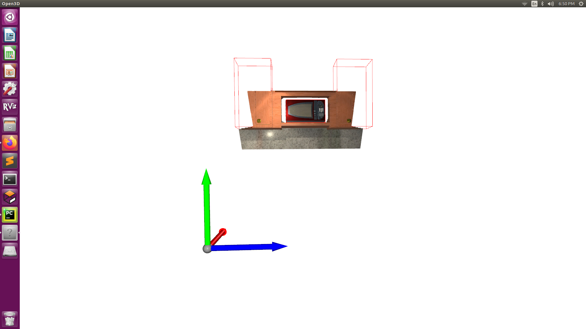
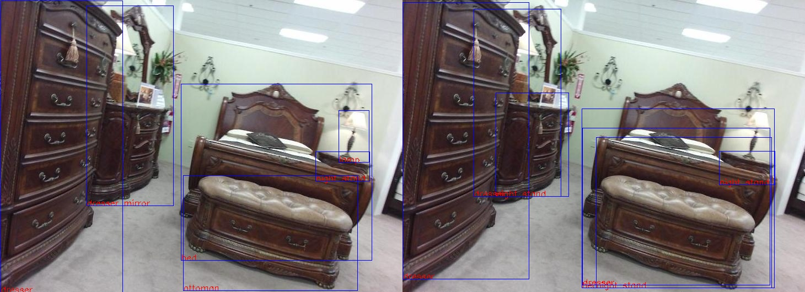
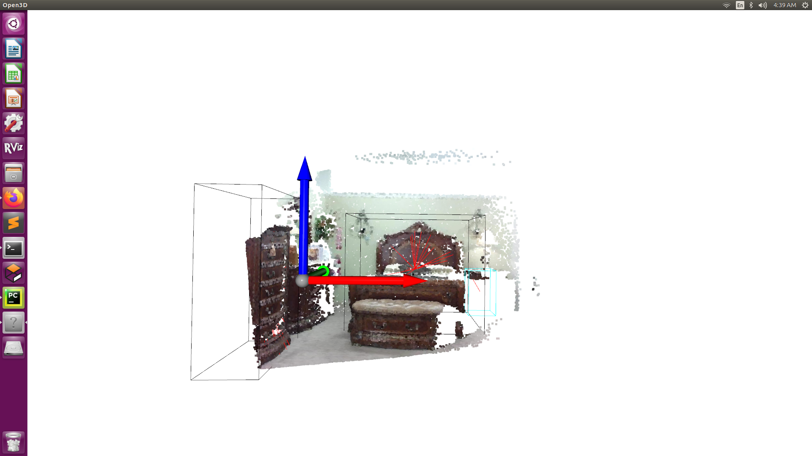

# Prepare test data from AI2THOR and AI-HABITAT

## Setup

This is developed in Ubuntu 16.04, however Ubuntu 18.04 is recommended because Open3D has a better support for 18.04

```commandline
pip install requirements.py
```

To run CloudRendering in `ai2thor`, 
```commandline
sudo apt-get install libvulkan1
```

If you are using Ubuntu 16.04, visualization may have some bugs, 
you can install a previous version or compile from source ([issue](https://github.com/isl-org/Open3D/issues/1307)).
Or you can also download a pre-built whl from [here](https://gist.github.com/district10/c9d3e2a353b3435a5545b80bf7aba746).

## Visualization

### rgb

### world coordinate point cloud and bounding boxes

### sunrgbd 2d bbox, left: dataset label, right: CNN detector label

### sunrgbd point cloud


## TODO

- [ ] query 2d bbox
- [ ] read votenet Dataset and see 3d bbox coordinate, camera or world
- [ ] know what bbox orientation means
- [ ] AI-Habitat
- [ ] Modify Dataset config of votenet
- [ ] SLAM and make the whole scene
- [ ] what is required from SPOT
